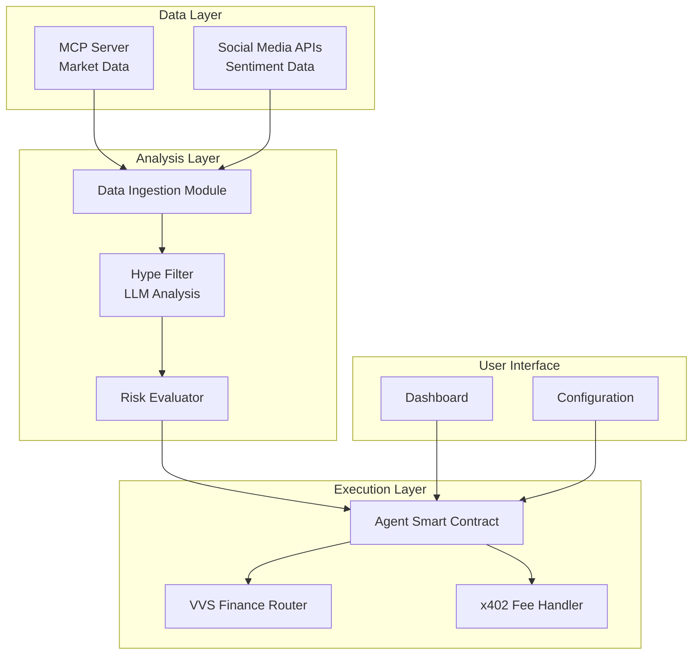
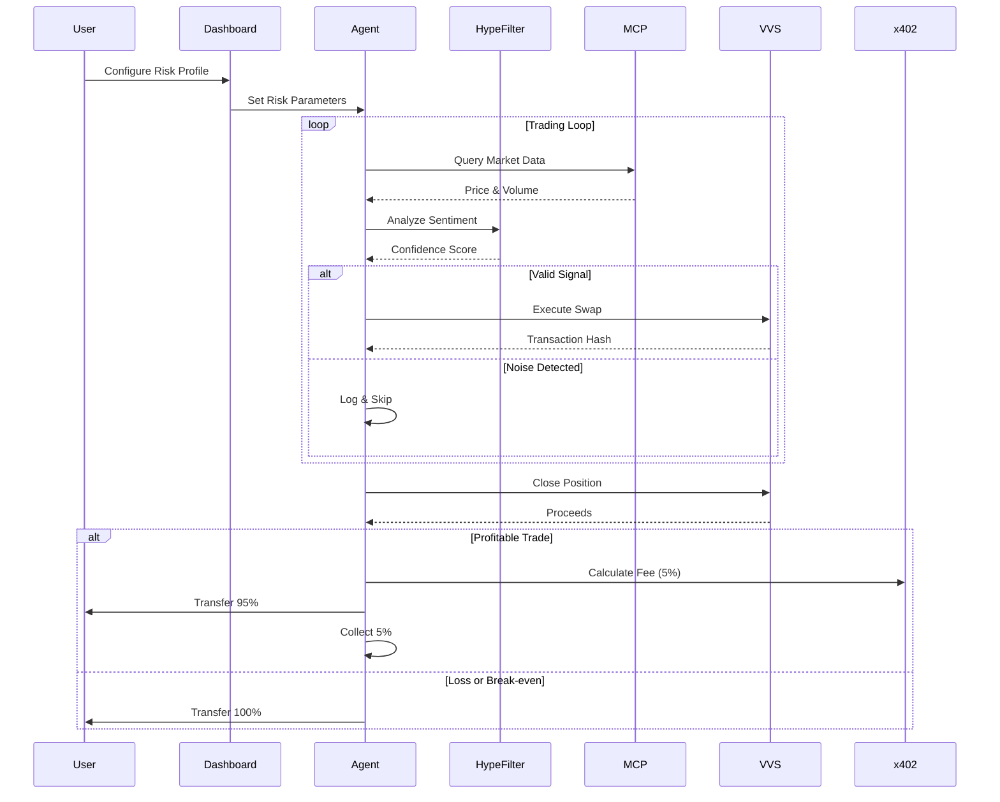
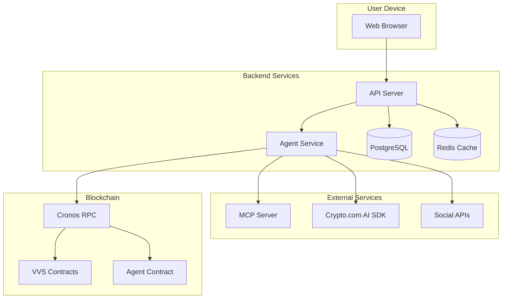

# Design Document: Sentinel AI Trading Agent

## Overview

Sentinel AI is an autonomous trading agent that operates on the Cronos EVM network, combining LLM-powered sentiment analysis with on-chain data to execute informed trades on VVS Finance. The system architecture follows a three-layer design: a data ingestion layer that collects market and sentiment data, an analysis layer that filters noise from genuine signals using LLMs, and an execution layer that autonomously trades on VVS Finance while implementing performance-based fees through the x402 protocol.

The agent operates in a continuous loop: ingesting data from multiple sources (MCP servers for market data, social media APIs for sentiment), processing this data through the Hype Filter algorithm powered by the Crypto.com AI Agent SDK, and executing trades based on user-defined risk profiles. The system uses session keys to enable autonomous operation without requiring user signatures for each transaction, while maintaining security through smart contract-enforced risk parameters.

## Architecture

### High-Level System Architecture



### Component Interaction Flow



## Components and Interfaces

### 1. Data Ingestion Module

**Responsibility:** Collect and normalize data from multiple sources.

**Interfaces:**

```typescript
interface IDataIngestion {
  // Fetch current market data for a token
  getMarketData(tokenAddress: string): Promise<MarketData>;
  
  // Fetch sentiment data from social sources
  getSentimentData(tokenSymbol: string): Promise<SentimentData>;
  
  // Subscribe to real-time updates
  subscribe(tokenAddress: string, callback: DataCallback): void;
}

interface MarketData {
  tokenAddress: string;
  price: number;
  volume24h: number;
  volumeTrend: 'RISING' | 'FLAT' | 'FALLING';
  timestamp: number;
}

interface SentimentData {
  tokenSymbol: string;
  mentions: number;
  sentiment: 'POSITIVE' | 'NEUTRAL' | 'NEGATIVE';
  sources: string[];
  smartMoneyMentions: number;
  timestamp: number;
}
```

**Implementation Notes:**
- Uses MCP server for market data with 60-second freshness requirement
- Aggregates sentiment from multiple social media sources
- Implements caching to reduce API calls
- Validates data timestamps before passing to analysis layer

### 2. Hype Filter (LLM Analysis Module)

**Responsibility:** Analyze sentiment data using LLMs to distinguish signal from noise.

**Interfaces:**

```typescript
interface IHypeFilter {
  // Analyze combined market and sentiment data
  analyze(marketData: MarketData, sentimentData: SentimentData): Promise<HypeAnalysis>;
  
  // Get confidence threshold for risk profile
  getConfidenceThreshold(riskProfile: RiskProfile): number;
}

interface HypeAnalysis {
  signal: 'VALID_BREAKOUT' | 'FAKE_PUMP' | 'ACCUMULATION' | 'NOISE';
  confidenceScore: number; // 0-100
  reasoning: string;
  timestamp: number;
}

type RiskProfile = 'GUARDIAN' | 'HUNTER';
```

**Algorithm Logic:**

```python
def analyze_hype(market_data, sentiment_data):
    # Use Crypto.com AI Agent SDK for LLM analysis
    sentiment_score = llm.analyze_sentiment(sentiment_data.text)
    volume_trend = market_data.volume_trend
    smart_money_factor = sentiment_data.smart_money_mentions
    
    # Decision matrix
    if sentiment_score == "HIGH_HYPE" and volume_trend == "FLAT":
        return HypeAnalysis(
            signal="FAKE_PUMP",
            confidence=85,
            reasoning="High social hype without volume support"
        )
    
    elif sentiment_score == "HIGH_HYPE" and volume_trend == "RISING":
        return HypeAnalysis(
            signal="VALID_BREAKOUT",
            confidence=90,
            reasoning="Social sentiment confirmed by volume"
        )
    
    elif sentiment_score == "LOW" and smart_money_factor > threshold:
        return HypeAnalysis(
            signal="ACCUMULATION",
            confidence=75,
            reasoning="Smart money activity without retail attention"
        )
    
    else:
        return HypeAnalysis(
            signal="NOISE",
            confidence=50,
            reasoning="Insufficient signal strength"
        )
```

### 3. Risk Evaluator

**Responsibility:** Validate trading signals against user risk profile.

**Interfaces:**

```typescript
interface IRiskEvaluator {
  // Evaluate if signal meets risk criteria
  evaluate(analysis: HypeAnalysis, profile: UserRiskProfile): Promise<TradeDecision>;
  
  // Check if token is allowed for profile
  isTokenAllowed(tokenAddress: string, profile: UserRiskProfile): boolean;
}

interface UserRiskProfile {
  mode: 'GUARDIAN' | 'HUNTER';
  allowedTokens: string[]; // Empty array means all tokens allowed
  minConfidenceScore: number;
  stopLossPercent: number;
  maxPositionSize: number;
}

interface TradeDecision {
  shouldTrade: boolean;
  action: 'BUY' | 'SELL' | 'HOLD';
  amount: number;
  reasoning: string;
}
```

### 4. Agent Smart Contract

**Responsibility:** Execute trades with session keys and enforce risk parameters on-chain.

**Solidity Interface:**

```solidity
interface IAgentContract {
    // Initialize agent with user configuration
    function initialize(
        address owner,
        RiskProfile profile,
        address[] memory allowedTokens
    ) external;
    
    // Execute a swap on VVS Finance
    function executeSwap(
        address tokenIn,
        address tokenOut,
        uint256 amountIn,
        uint256 minAmountOut
    ) external returns (uint256 amountOut);
    
    // Close position and distribute proceeds
    function closePosition(
        address token,
        uint256 amount
    ) external returns (uint256 profit);
    
    // Emergency stop
    function pause() external;
}

struct RiskProfile {
    ProfileType profileType; // GUARDIAN or HUNTER
    uint256 minConfidenceScore;
    uint256 stopLossPercent;
    uint256 maxPositionSize;
}

enum ProfileType {
    GUARDIAN,
    HUNTER
}
```

**Key Features:**
- Uses EIP-4337 account abstraction or similar for session keys
- Enforces risk parameters at smart contract level
- Integrates with VVS Finance IUniswapV2Router02
- Implements x402 fee distribution logic

### 5. x402 Fee Handler

**Responsibility:** Calculate and distribute performance-based fees.

**Interfaces:**

```typescript
interface IX402FeeHandler {
  // Calculate fee for a closed position
  calculateFee(entryPrice: number, exitPrice: number, amount: number): FeeCalculation;
  
  // Distribute proceeds with x402 header
  distributeProceedsWithFee(
    userAddress: string,
    agentAddress: string,
    totalProceeds: number,
    fee: number
  ): Promise<string>; // Returns transaction hash
}

interface FeeCalculation {
  profit: number;
  feeAmount: number;
  feePercent: number;
  userAmount: number;
}
```

**Fee Logic:**
```
profit = exitPrice - entryPrice
if profit > 0:
    fee = profit * 0.05  // 5% of profit
    userAmount = totalProceeds - fee
else:
    fee = 0
    userAmount = totalProceeds
```

### 6. VVS Finance Integration

**Responsibility:** Interface with VVS Finance DEX for trade execution.

**Interfaces:**

```typescript
interface IVVSIntegration {
  // Get optimal swap route
  getSwapRoute(tokenIn: string, tokenOut: string, amountIn: number): Promise<SwapRoute>;
  
  // Execute swap with slippage protection
  executeSwap(route: SwapRoute, maxSlippage: number): Promise<SwapResult>;
  
  // Get current reserves for price calculation
  getReserves(tokenA: string, tokenB: string): Promise<Reserves>;
}

interface SwapRoute {
  path: string[];
  expectedOutput: number;
  priceImpact: number;
}

interface SwapResult {
  transactionHash: string;
  amountIn: number;
  amountOut: number;
  gasUsed: number;
}
```

## Data Models

### Core Domain Models

```typescript
// Trading Position
interface Position {
  id: string;
  tokenAddress: string;
  tokenSymbol: string;
  entryPrice: number;
  entryAmount: number;
  entryTimestamp: number;
  exitPrice?: number;
  exitAmount?: number;
  exitTimestamp?: number;
  status: 'OPEN' | 'CLOSED';
  profitLoss?: number;
  feePaid?: number;
}

// Trade Signal
interface TradeSignal {
  id: string;
  tokenAddress: string;
  signalType: 'BUY' | 'SELL';
  hypeAnalysis: HypeAnalysis;
  marketData: MarketData;
  sentimentData: SentimentData;
  timestamp: number;
  executed: boolean;
}

// Agent State
interface AgentState {
  isActive: boolean;
  riskProfile: UserRiskProfile;
  openPositions: Position[];
  totalProfitLoss: number;
  totalFeesPaid: number;
  tradesExecuted: number;
  tradesWon: number;
  lastUpdateTimestamp: number;
}

// Configuration
interface AgentConfiguration {
  ownerAddress: string;
  agentAddress: string;
  riskProfile: UserRiskProfile;
  mcpEndpoint: string;
  vvsRouterAddress: string;
  cronosRpcUrl: string;
  sessionKeyExpiry: number;
}
```

### Database Schema (for off-chain storage)

```sql
-- Positions table
CREATE TABLE positions (
    id VARCHAR(66) PRIMARY KEY,
    token_address VARCHAR(42) NOT NULL,
    token_symbol VARCHAR(10) NOT NULL,
    entry_price DECIMAL(36, 18) NOT NULL,
    entry_amount DECIMAL(36, 18) NOT NULL,
    entry_timestamp BIGINT NOT NULL,
    exit_price DECIMAL(36, 18),
    exit_amount DECIMAL(36, 18),
    exit_timestamp BIGINT,
    status VARCHAR(10) NOT NULL,
    profit_loss DECIMAL(36, 18),
    fee_paid DECIMAL(36, 18),
    INDEX idx_status (status),
    INDEX idx_entry_timestamp (entry_timestamp)
);

-- Trade signals table
CREATE TABLE trade_signals (
    id VARCHAR(66) PRIMARY KEY,
    token_address VARCHAR(42) NOT NULL,
    signal_type VARCHAR(4) NOT NULL,
    signal_classification VARCHAR(20) NOT NULL,
    confidence_score INT NOT NULL,
    reasoning TEXT,
    timestamp BIGINT NOT NULL,
    executed BOOLEAN NOT NULL,
    INDEX idx_timestamp (timestamp),
    INDEX idx_executed (executed)
);

-- Agent events table
CREATE TABLE agent_events (
    id SERIAL PRIMARY KEY,
    event_type VARCHAR(50) NOT NULL,
    event_data JSONB NOT NULL,
    timestamp BIGINT NOT NULL,
    INDEX idx_event_type (event_type),
    INDEX idx_timestamp (timestamp)
);
```

## 
Correctness Properties

*A property is a characteristic or behavior that should hold true across all valid executions of a system-essentially, a formal statement about what the system should do. Properties serve as the bridge between human-readable specifications and machine-verifiable correctness guarantees.*

### Property 1: Sentiment confidence score bounds

*For any* text input processed through sentiment analysis, the generated confidence score should be between 0 and 100 inclusive.

**Validates: Requirements 1.2**

### Property 2: Noise classification for high sentiment with flat volume

*For any* market data with high sentiment scores and flat trading volume, the Hype Filter should classify the signal as noise.

**Validates: Requirements 1.3**

### Property 3: Valid signal classification for high sentiment with rising volume

*For any* market data with high sentiment scores and rising trading volume, the Hype Filter should classify the signal as valid.

**Validates: Requirements 1.4**

### Property 4: Guardian mode confidence threshold enforcement

*For any* trading signal with confidence score below 90 in Guardian mode, the agent should not execute the trade.

**Validates: Requirements 1.5**

### Property 5: Guardian mode token restriction

*For any* token not in the allowed list (CRO, USDC, WBTC), the agent should reject trades when Guardian mode is active.

**Validates: Requirements 2.2**

### Property 6: Hunter mode token allowance

*For any* token address, the agent should allow trading when Hunter mode is active.

**Validates: Requirements 2.3**

### Property 7: VVS Router interface usage

*For any* valid trading signal, the constructed transaction should use the VVS Finance IUniswapV2Router02 interface.

**Validates: Requirements 3.1**

### Property 8: Buy order function call correctness

*For any* buy order execution, the agent should call swapExactTokensForTokens with the calculated optimal entry amount.

**Validates: Requirements 3.2**

### Property 9: Session key signing

*For any* trade execution, the transaction should be signed using session keys without requiring user approval.

**Validates: Requirements 3.3**

### Property 10: Stop loss trigger

*For any* open position that reaches the configured stop loss threshold, the agent should automatically execute a sell order.

**Validates: Requirements 3.4**

### Property 11: Profit calculation correctness

*For any* closed position with entry price and exit price, the calculated profit should equal the difference between exit price and entry price multiplied by the position amount.

**Validates: Requirements 4.1**

### Property 12: Fee calculation for profitable trades

*For any* closed position with positive profit, the x402 fee should be exactly 5 percent of the profit.

**Validates: Requirements 4.2**

### Property 13: Profitable trade distribution

*For any* profitable trade distribution, 95 percent of proceeds should go to the user wallet and 5 percent to the agent wallet.

**Validates: Requirements 4.3**

### Property 14: No fee for non-profitable trades

*For any* closed position with zero or negative profit, 100 percent of proceeds should be transferred to the user wallet with zero fee.

**Validates: Requirements 4.4**

### Property 15: Fee transaction event emission

*For any* x402 fee transaction, an event should be emitted containing the profit amount and fee amount.

**Validates: Requirements 4.5**

### Property 16: MCP price data query

*For any* trading opportunity evaluation, the agent should query the MCP server for current price data of the target token.

**Validates: Requirements 5.1**

### Property 17: MCP volume data retrieval

*For any* market condition analysis, the agent should retrieve trading volume trends from the MCP server.

**Validates: Requirements 5.2**

### Property 18: Market data timestamp validation

*For any* received market data, the agent should validate that the timestamp is within 60 seconds of the current time.

**Validates: Requirements 5.4**

### Property 19: VVS contract interaction

*For any* trade execution on Cronos, the agent should interact with VVS Finance smart contracts at the correct mainnet addresses.

**Validates: Requirements 6.2**

### Property 20: CRO gas payment

*For any* transaction submission on Cronos, the agent should use CRO as the native token for gas fee payment.

**Validates: Requirements 6.3**

### Property 21: Trade recording completeness

*For any* executed trade, the agent should record the transaction hash, entry price, exit price, and profit or loss amount.

**Validates: Requirements 8.1**

### Property 22: Trading history completeness

*For any* request for trading history, the agent should retrieve and return all completed trades with timestamps.

**Validates: Requirements 8.2**

### Property 23: Performance metrics calculation

*For any* set of completed trades, the calculated total profit/loss should equal the sum of individual trade profits/losses, and win rate should equal the number of profitable trades divided by total trades.

**Validates: Requirements 8.3**

### Property 24: Noise detection logging

*For any* trade prevented due to noise detection, the agent should create a log entry containing the confidence score and reasoning.

**Validates: Requirements 8.4**

## Error Handling

### Error Categories and Strategies

**1. Network Errors**

- **MCP Server Unavailable:** Halt all trading operations, log error, retry connection with exponential backoff (max 3 attempts), notify user via dashboard
- **RPC Connection Failure:** Attempt reconnection with backup RPC endpoints, pause trading if all endpoints fail
- **Transaction Timeout:** Retry with increased gas price (up to 3 attempts), mark transaction as failed if all retries fail

**2. Smart Contract Errors**

- **Insufficient Balance:** Reject trade, log error, update dashboard with insufficient balance warning
- **Slippage Exceeded:** Retry with adjusted slippage tolerance (up to 2 attempts), skip trade if still failing
- **Contract Revert:** Log revert reason, skip trade, alert user if pattern of reverts detected

**3. Data Validation Errors**

- **Stale Market Data:** Reject data with timestamp > 60 seconds old, request fresh data from MCP
- **Invalid Confidence Score:** Log error, treat as confidence score of 0, skip trade
- **Missing Required Fields:** Reject incomplete data, log validation error, request complete data

**4. Configuration Errors**

- **Invalid Risk Profile:** Reject configuration, use default Guardian mode, notify user
- **Invalid Token Address:** Reject trade, log error with token address
- **Invalid Stop Loss Value:** Reject configuration, use profile default

**5. LLM/AI Errors**

- **API Rate Limit:** Queue request for retry with exponential backoff, pause new analyses temporarily
- **Analysis Timeout:** Mark analysis as failed, skip trade, log timeout event
- **Invalid Response Format:** Log error, treat as low confidence (score 0), skip trade

### Error Recovery Patterns

```typescript
// Retry with exponential backoff
async function retryWithBackoff<T>(
  operation: () => Promise<T>,
  maxAttempts: number = 3,
  baseDelay: number = 1000
): Promise<T> {
  for (let attempt = 1; attempt <= maxAttempts; attempt++) {
    try {
      return await operation();
    } catch (error) {
      if (attempt === maxAttempts) throw error;
      const delay = baseDelay * Math.pow(2, attempt - 1);
      await sleep(delay);
    }
  }
  throw new Error('Max retries exceeded');
}

// Circuit breaker for external services
class CircuitBreaker {
  private failureCount = 0;
  private lastFailureTime = 0;
  private state: 'CLOSED' | 'OPEN' | 'HALF_OPEN' = 'CLOSED';
  
  async execute<T>(operation: () => Promise<T>): Promise<T> {
    if (this.state === 'OPEN') {
      if (Date.now() - this.lastFailureTime > 60000) {
        this.state = 'HALF_OPEN';
      } else {
        throw new Error('Circuit breaker is OPEN');
      }
    }
    
    try {
      const result = await operation();
      this.onSuccess();
      return result;
    } catch (error) {
      this.onFailure();
      throw error;
    }
  }
  
  private onSuccess() {
    this.failureCount = 0;
    this.state = 'CLOSED';
  }
  
  private onFailure() {
    this.failureCount++;
    this.lastFailureTime = Date.now();
    if (this.failureCount >= 5) {
      this.state = 'OPEN';
    }
  }
}
```

### Error Logging and Monitoring

All errors should be logged with the following structure:

```typescript
interface ErrorLog {
  timestamp: number;
  errorType: string;
  errorMessage: string;
  stackTrace?: string;
  context: {
    component: string;
    operation: string;
    tokenAddress?: string;
    transactionHash?: string;
  };
  severity: 'LOW' | 'MEDIUM' | 'HIGH' | 'CRITICAL';
  userNotified: boolean;
}
```

**Severity Levels:**
- **LOW:** Non-critical errors that don't affect trading (e.g., logging failures)
- **MEDIUM:** Errors that cause single trade to fail (e.g., slippage exceeded)
- **HIGH:** Errors that affect multiple trades (e.g., MCP server down)
- **CRITICAL:** Errors that halt all operations (e.g., smart contract compromise detected)

## Testing Strategy

### Unit Testing

Unit tests will verify specific examples and integration points between components. The testing framework will be **Jest** for TypeScript/JavaScript components and **Hardhat** for Solidity smart contracts.

**Key Unit Test Areas:**

1. **Data Ingestion Module**
   - Test MCP server connection and data fetching
   - Test data normalization and validation
   - Test error handling for API failures

2. **Hype Filter Module**
   - Test LLM integration with Crypto.com AI Agent SDK
   - Test decision matrix logic with specific examples
   - Test confidence score calculation

3. **Risk Evaluator**
   - Test Guardian mode token filtering with specific tokens
   - Test Hunter mode allowance logic
   - Test stop loss threshold enforcement

4. **Smart Contract**
   - Test initialization with different risk profiles
   - Test VVS Router integration
   - Test x402 fee distribution logic
   - Test emergency pause functionality

5. **x402 Fee Handler**
   - Test fee calculation with specific profit values
   - Test zero fee for losses
   - Test distribution logic

### Property-Based Testing

Property-based tests will verify universal properties that should hold across all inputs. The testing framework will be **fast-check** for TypeScript/JavaScript.

**Configuration:**
- Each property-based test MUST run a minimum of 100 iterations
- Each test MUST be tagged with a comment referencing the correctness property from this design document
- Tag format: `// Feature: sentinel-ai-trading-agent, Property {number}: {property_text}`
- Each correctness property MUST be implemented by a SINGLE property-based test

**Property Test Implementation Requirements:**

1. **Generators:** Create smart generators that constrain to valid input spaces
   - Market data generator: valid prices, volumes, timestamps
   - Sentiment data generator: valid confidence scores, sentiment types
   - Risk profile generator: valid Guardian/Hunter configurations
   - Token address generator: valid Ethereum addresses

2. **Test Organization:** Co-locate property tests with unit tests using `.property.test.ts` suffix

3. **Failure Reporting:** When a property test fails, capture and report the minimal failing example

**Example Property Test Structure:**

```typescript
import fc from 'fast-check';

// Feature: sentinel-ai-trading-agent, Property 2: Noise classification for high sentiment with flat volume
describe('Hype Filter Properties', () => {
  it('should classify high sentiment with flat volume as noise', () => {
    fc.assert(
      fc.property(
        fc.record({
          sentimentScore: fc.integer({ min: 80, max: 100 }),
          volumeTrend: fc.constant('FLAT'),
          price: fc.double({ min: 0.01, max: 10000 }),
        }),
        (marketData) => {
          const result = hypeFilter.analyze(marketData);
          expect(result.signal).toBe('NOISE');
        }
      ),
      { numRuns: 100 }
    );
  });
});
```

### Integration Testing

Integration tests will verify end-to-end workflows:

1. **Complete Trading Loop:** Data ingestion → Analysis → Execution → Fee distribution
2. **MCP Integration:** Real MCP server queries and data processing
3. **VVS Integration:** Forked mainnet testing with actual VVS contracts
4. **Dashboard Integration:** API endpoints and real-time updates

### Test Environment Setup

**Local Development:**
- Hardhat forked Cronos mainnet for smart contract testing
- Mock MCP server for predictable market data
- Mock social media APIs for sentiment data

**CI/CD Pipeline:**
- Automated unit tests on every commit
- Property-based tests on every pull request
- Integration tests on staging environment before deployment

## Security Considerations

### Smart Contract Security

1. **Session Key Management**
   - Session keys have expiration timestamps
   - Keys can only execute trades within risk parameters
   - Owner can revoke session keys at any time
   - Keys cannot withdraw funds directly

2. **Reentrancy Protection**
   - Use OpenZeppelin ReentrancyGuard on all external calls
   - Follow checks-effects-interactions pattern

3. **Access Control**
   - Only owner can modify risk profile
   - Only authorized session keys can execute trades
   - Emergency pause function restricted to owner

### API Security

1. **MCP Server Authentication**
   - Use API keys for MCP server access
   - Rotate keys regularly
   - Rate limiting to prevent abuse

2. **LLM API Security**
   - Secure storage of Crypto.com AI Agent SDK credentials
   - Request signing for API calls
   - Input sanitization to prevent prompt injection

### Data Security

1. **Private Key Management**
   - Never log or expose private keys
   - Use hardware wallet or secure enclave for owner key
   - Session keys stored encrypted at rest

2. **User Data Privacy**
   - Trading history stored with user consent
   - No sharing of trading strategies or positions
   - Compliance with data protection regulations

## Deployment Architecture

### Infrastructure Components



### Deployment Strategy

**Phase 1: Local Development**
- Hardhat forked mainnet
- Mock external services
- Local PostgreSQL and Redis

**Phase 2: Testnet Deployment**
- Deploy to Cronos testnet
- Connect to testnet VVS contracts
- Use test MCP endpoints
- Limited user testing

**Phase 3: Mainnet Deployment**
- Deploy agent contract to Cronos mainnet
- Connect to production MCP and LLM services
- Gradual rollout with position size limits
- Monitoring and alerting setup

### Monitoring and Observability

**Metrics to Track:**
- Trade execution success rate
- Average confidence scores
- Profit/loss per trade
- Gas costs per transaction
- API response times
- Error rates by category

**Alerting Thresholds:**
- Error rate > 5% in 5 minutes
- MCP server down for > 1 minute
- Unusual trading volume (> 10x normal)
- Smart contract balance below minimum
- Session key expiring within 24 hours

## Performance Considerations

### Latency Requirements

- **Data Ingestion:** < 1 second for market data fetch
- **Sentiment Analysis:** < 3 seconds for LLM processing
- **Trade Execution:** < 5 seconds from signal to transaction submission
- **Dashboard Updates:** < 500ms for real-time data refresh

### Scalability

- **Concurrent Users:** Support up to 1000 active agents
- **Data Storage:** Partition trading history by user and time
- **API Rate Limits:** Implement request queuing for LLM API
- **Caching Strategy:** Cache market data for 10 seconds, sentiment data for 30 seconds

### Optimization Strategies

1. **Batch Processing:** Group multiple sentiment analyses when possible
2. **Connection Pooling:** Reuse database and RPC connections
3. **Lazy Loading:** Load historical data on-demand in dashboard
4. **CDN:** Serve static dashboard assets from CDN

## Future Enhancements

### Phase 2 Features

1. **Multi-DEX Support:** Expand beyond VVS to other Cronos DEXes
2. **Advanced Risk Profiles:** Custom risk profiles with fine-grained controls
3. **Portfolio Management:** Support multiple simultaneous positions
4. **Backtesting:** Historical simulation of trading strategies

### Phase 3 Features

1. **Cross-Chain Support:** Expand to other EVM chains
2. **Social Trading:** Follow and copy successful agents
3. **Advanced Analytics:** ML-based performance prediction
4. **Mobile App:** Native iOS and Android applications

## Glossary Additions

- **Circuit Breaker:** A design pattern that prevents cascading failures by temporarily blocking operations to a failing service
- **Slippage:** The difference between expected trade price and actual execution price
- **Session Key:** A temporary cryptographic key with limited permissions for autonomous operations
- **Property-Based Testing:** A testing methodology that verifies properties hold across randomly generated inputs
- **Fast-check:** A property-based testing library for JavaScript/TypeScript
